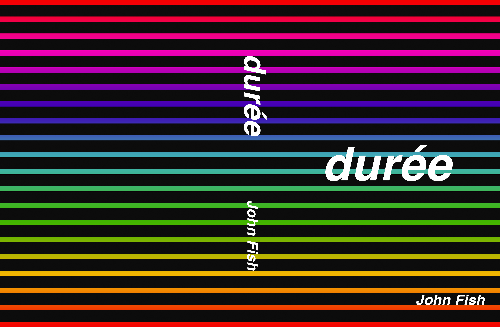

# durée
Durée is the longest book of all time. There are fifteen volumes published, each of which is approximately 800,000 words long.

The book is written by a Python script (which was in turn written by John Fish). The script is available online and is open-source. It uses a list of English words and sentence structure rules to create grammatically correct but generally nonsensical sentences.

Ultimately, the book was inspired by one phrase (from Noam Chomsky):

> Colorless green ideas sleep furiously

This phrase was given by Chomsky as a grammatically correct but semantically nonsensical sentence. To me, it had a certain playfulness to it which appealed to me. So, I decided to see if I could come up with a program to generate these sentences for me automatically and durée is the result of this experiment.

I didn't go for the longest book of all time because I believe that it deserves the title. I went for the longest book of all time because it's good clickbait, and also because the former book of all time is "The Blah Story" and once I saw that, I had to one-up it.

Truly, the longest written book of all time is Devta, with 11,206,310 words written over 33 years. Durée is but a mere publicity stunt designed to educate people about linguistics and get views on YouTube.

Now, I did print a copy of each of the fifteen volumes which means that I am responsible for over 12,000 pieces of paper which is about one and a half trees. I felt guilt about this (as should you, if you were to whimsically waste such an enormous amount of paper) and so made a donation to the Eden Reforestation Projects (https://edenprojects.org) where trees are planted in deforested areas by local citizens who are paid a fair wage. The cost to plant a tree according to them is "anywhere from $0.10 to $0.35 cents a tree" including employment, administration costs, etc. My donation will thus be responsible for the planting of orders of magnitude more trees than my silly project cut down.

If you wish, you can purchase an abridged copy of durée on Amazon (link coming soon). It's a fun coffee-table book.

